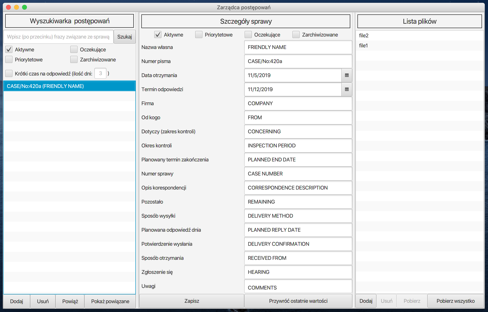
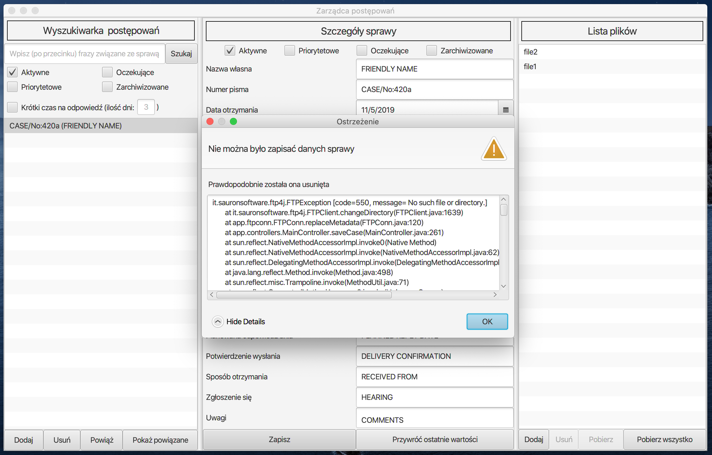

# CaseOrganizer
Case organizer for a law office

- [TECHNOLOGIES](#technologies)
- [FEATURES](#features)
- [RUNNING THE PROJECT](#running-the-project)
- [HOW TO USE](#how-to-use)
- [ADDITIONAL INFO](#additional-info)
- [CONTRIBUTING](#contributing)

## TECHNOLOGIES
- JAXB
- JavaFX (+ Gluon Scene Builder)
- Apache Commons Configuration
- Sauron Software ftp4j

## FEATURES
- persistent data storage utilizing FTP protocol
- beautiful, accessible UI
- smart error handling

## RUNNING THE PROJECT
In order to run the program, download the latest binary release. If you'd rather build it yourself, clone the repository and type `$ gradle run`. Alternatively, you can create your own standalone JAR of the application by running `$ gradle jar` and retrieving it from `/build/libs`.

## HOW TO USE

First you'll be presented with a login window - enter your FTP server credentials and click the Login button to proceed to the main screen.

From here you are free to search for cases, add new ones, delete cases, link them to one another, inspect the links, edit case data and upload / download / delete relevant case files.

Should the program enter an unrecoverable state (e.g. internet access was lost), the user will be presented with a developer-friendly error message, then further program execution will be halted to avoid data loss.

## ADDITIONAL INFO
The project was tested on macOS 10.15 Catalina, using Java 8u221.

## CONTRIBUTING
- Dawid Gałka
- Wojciech Jarząbek
